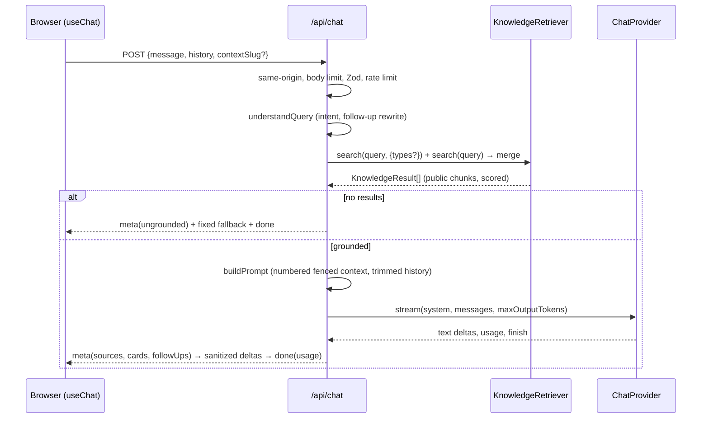

# Architecture

## System view

```text
                    ┌───────────────────┐
                    │      Visitor      │
                    └─────────┬─────────┘
                              │ HTTPS
                    ┌─────────▼─────────┐
                    │  Next.js 16 UI    │  App Router: server components for pages,
                    │  (chat + pages)   │  client components for chat/search/dialogs
                    └─────────┬─────────┘
             ┌────────────────┼──────────────────┐
             ▼                ▼                   ▼
      POST /api/chat    GET /api/search     GET /api/health  (+ POST /api/analytics)
             │                │
             ▼                │
   ┌───────────────────────┐  │
   │ AI orchestration      │  │   lib/ai/rag.ts: query understanding → retrieval →
   │ (RAG)                 │  │   grounded prompt → sources/cards/follow-ups
   └───────────┬───────────┘  │
               ▼              ▼
   ┌───────────────────────────────┐
   │ KnowledgeRetriever (interface)│   lib/retrieval/types.ts
   ├───────────────┬───────────────┤
   │ HybridRetriever│LexicalRetriever│  RRF(vector, BM25)  |  BM25 only
   └───────┬───────┴───────┬───────┘
           ▼               │
   ┌─────────────────┐     │
   │ VectorStore     │     │       FileVectorStore (default, data/knowledge-index.json)
   │ file | pgvector │     │       PgVectorStore (optional) / InMemoryVectorStore (tests)
   └────────▲────────┘     │
            │              │
   ┌────────┴────────┐     │
   │ content:index   │     │       scripts/index-content.ts → lib/knowledge/indexer.ts
   └────────▲────────┘     │
            │              ▼
   ┌────────┴──────────────────────┐
   │ Knowledge repository          │  lib/knowledge/repository.ts (public-only accessors)
   │  parse → validate → chunk     │
   └────────▲──────────────────────┘
            │
      content/**/*.md   (source of truth)
```

## Layers and boundaries

| Layer | Location | Responsibility | Trust |
| --- | --- | --- | --- |
| Presentation | `src/app`, `src/components` | Pages, chat UI, search palette, cards, SEO | Renders only public data; sanitized Markdown |
| API | `src/app/api/*` | Validation, rate limiting, streaming, error mapping | Trust boundary — everything from the client is untrusted |
| AI orchestration | `src/lib/ai` | Query understanding, prompt assembly, providers, citations, cards | Retrieved content is data, never instructions |
| Retrieval | `src/lib/retrieval` | `KnowledgeRetriever`, `VectorStore`, lexical/hybrid ranking | Public chunks only |
| Content ingestion | `src/lib/knowledge`, `scripts/*` | Parse, validate, normalize, chunk, hash, embed, index | Fail fast on invalid content |
| Infrastructure | `src/lib/config`, `src/lib/security`, `src/lib/observability` | Env validation, limits, logging, metrics | Secrets never leave the server |

## Request flow (chat)



## Retrieval design

- **Chunks** are H2/H3 sections with a breadcrumb; ids are `slug::section-slug::ordinal`; hashes cover title + heading path + text.
- **Lexical leg**: BM25 with light stemming, compound tech tokens (`asp.net` → `asp.net`, `asp`, `net`), query-only stopwords for framing words ("show me", "experience with", "currently"), synonym expansion at weight 0.4, BM25F-style metadata field (type/tags/technologies at 0.3), title boost, prose-only coverage. Grounding requires at least one prose hit (two for 3+ term queries) and a normalized score ≥ 0.2.
- **Vector leg**: `text-embedding-3-small` cosine search over the committed JSON index (brute force, in memory) or pgvector (HNSW); public rows only; similarity floor (`RETRIEVAL_MIN_SIMILARITY`, default 0.3).
- **Fusion**: reciprocal rank fusion (k = 60); a lexical hit below the coverage requirement is down-weighted rather than dropped; fused score normalized to [0, 1] with a 0.2 floor.
- **Intent bias**: the orchestrator runs a type-scoped search first (anchored with that type's own vocabulary) and fills the rest with general results.
- **Degradation**: if the vector store or embedding API is unreachable, the hybrid retriever logs `vector_leg_failed` and serves lexical results so chat stays up.

## Context management

`trimConversation` keeps the last 6 turns (≤ 1200 chars each, ≤ 4000 total) verbatim and summarizes dropped user questions into one line for the system prompt — no LLM call, no unbounded history. Retrieved context is capped at ~9 000 characters.

## Data model

**File index** (`data/knowledge-index.json`, default): `{version, embeddingModel, dimensions, generatedAt, records[{chunkId, documentSlug, type, visibility, contentHash, embedding}]}` — no text.

**pgvector** (optional, `db/migrations/001_knowledge_chunks.sql`):

```text
knowledge_chunks(chunk_id PK, document_slug, title, section, type, tags text[], visibility,
                 content, content_hash, embedding vector(N), metadata jsonb, created_at, updated_at)
  idx: document_slug, type, hnsw(embedding vector_cosine_ops)
knowledge_meta(key PK, value)   -- "<table>.embedding_model", "<table>.embedding_dimensions"
```

**Content types** (`src/types/content.ts`): `ContentDocument` (frontmatter + body + typed blocks: `profile`, `skillGroups`, `project`, `experience`, `certifications`, `education`) and `ContentChunk`.

**Wire protocol** (`src/types/chat.ts`): NDJSON — `meta` (requestId, mode, grounded, sources[], cards[], followUps[]) → `delta`* → `done` (usage, finishReason) | `error`.

## Rendering strategy

Pages are prerendered at build time (SSG) from Markdown; project and topic pages use `generateStaticParams`. API routes are dynamic (Node runtime). The chat container is a client component; the shell reads profile/topics on the server and passes plain props.

## Observability

`RequestMetrics` emits one JSON line per request (`chat_completed`, `search_completed`, `provider_error_*`, `rate_limited`, `vector_leg_failed`, …) with `requestId`, stage durations, retrieved chunk count, mode, tokens, and `estimatedCostUsd`. `sanitizeLogFields` drops any field whose key could carry prompt text, PII, or secrets. Analytics events (`chat_started`, `question_submitted`, `citation_opened`, …) arrive via `POST /api/analytics` and are logged the same way — no third-party script, no message contents.
